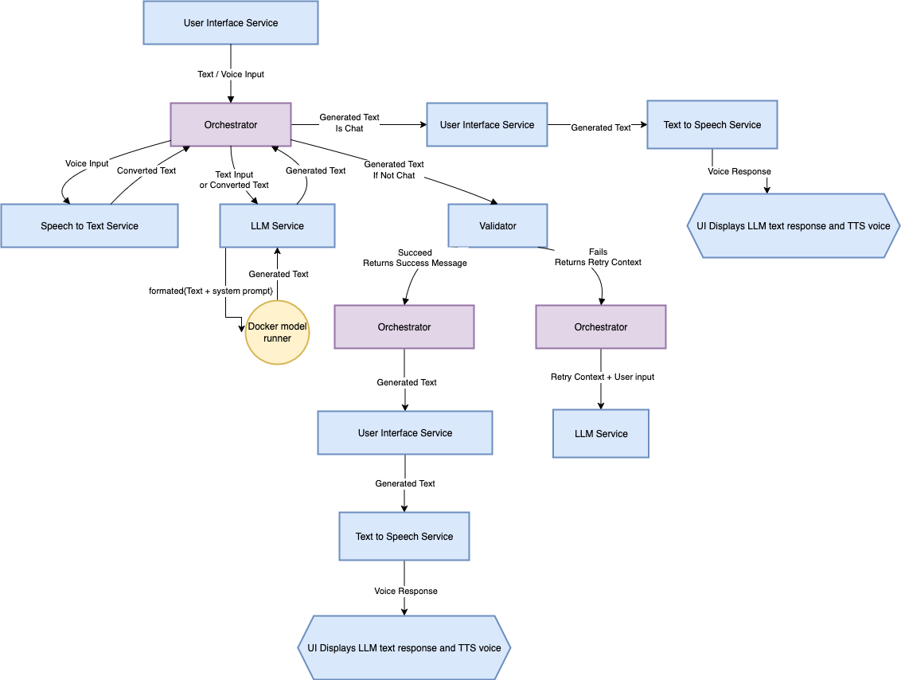
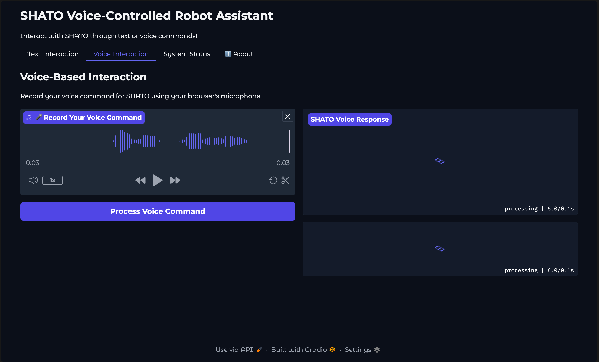
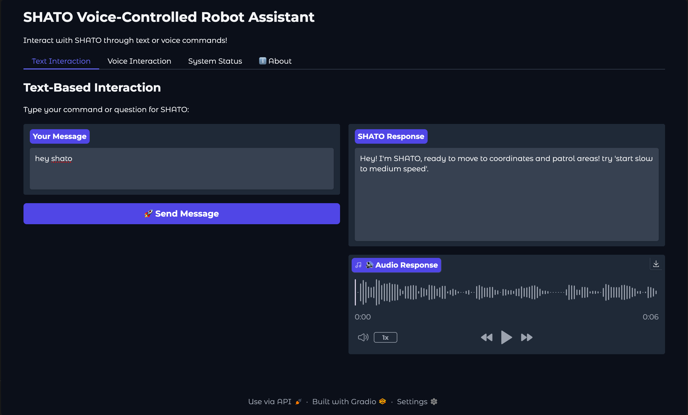

# SHATO - Voice-Controlled Robotic Assistant

*Intelligent, Lightweight, and Bulletproof Robot Command Processing*

## What is SHATO?

SHATO is a production-ready voice-controlled robotic assistant that transforms natural language into precise robot commands. Built with a sophisticated microservices architecture, SHATO combines cutting-edge AI with robust validation to ensure your robot never receives a malformed command.

---

## Key Features

### **Intelligent Command Understanding**
- **Fine-tuned Gemma 270M** model specifically trained for robot command recognition
- Understands natural language: *"move to the kitchen"* → `move_to(x=5, y=7)`
- Supports complex instructions with context awareness

### **Bulletproof Validation System**
- **Zero malformed commands** reach your robot hardware
- Strict schema validation with Pydantic models
- Real-time parameter verification (coordinates, angles, routes)
- **Self-correction loops** automatically fix invalid commands before execution

### **Complete Voice Pipeline**
- **OpenAI Whisper** speech-to-text with noise filtering
- **Parler TTS** for natural voice responses
- Multi-modal interaction: text and voice simultaneously
- Correlation ID tracking for full request traceability

### **Lightweight & Fast**
- **270M parameter model** 
- Optimized Docker containers with health monitoring

### **Architecture**
- **Microservices design** 
- Full **Docker Compose** orchestration
- Comprehensive logging and monitoring
- **Graceful error handling** with automatic retry mechanisms

---

## System Architecture

**Six specialized microservices** working in perfect harmony:
- **LLM Service**: Fine-tuned Gemma 270M for robot command extraction
- **Robot Validator**: command validation
- **STT Service**: Speech-to-text with OpenAI Whisper
- **TTS Service**: Natural voice synthesis with Parler TTS
- **Orchestrator**: Central routing and error handling
- **UI Service**: Clean Gradio interface for testing and monitoring

---

## Supported Robot Commands

| Command | Example Input | Generated Output |
|---------|---------------|------------------|
| **Movement** | *"Go to coordinates 5, 7"* | `move_to(x=5, y=7)` |
| **Rotation** | *"Turn 90 degrees clockwise"* | `rotate(angle=90, direction="clockwise")` |
| **Patrol** | *"Start monitoring the bedrooms"* | `start_patrol(route="bedrooms", repeat=3)` |

**Smart Intent Recognition:**
- Handles typos and colloquialisms: *"rotat 30 degres clockwize"*
- Understands context: *"patrol second floor continuously"* → `repeat_count=-1`
- Rejects impossible commands: *"fly to the moon"* → Polite refusal

---

## Performance Metrics

| Metric | Performance |
|--------|-------------|
| **Response Time** | Fast |
| **Command Accuracy** | Excellent |
| **Memory Usage** | < 2GB per service |
| **Validation Success** | 100% malformed command prevention |

---

## Interface Showcase

### Voice Command Processing

*Record voice commands using your browser's microphone for hands-free robot control*

### Voice Command Interface  

*Instant response, command validation and audio feedback*

### Text Command Interface

*Clean text-based interaction with instant command validation and audio feedback*

**Experience the power of natural language robot control with professional-grade validation and instant feedback.**

